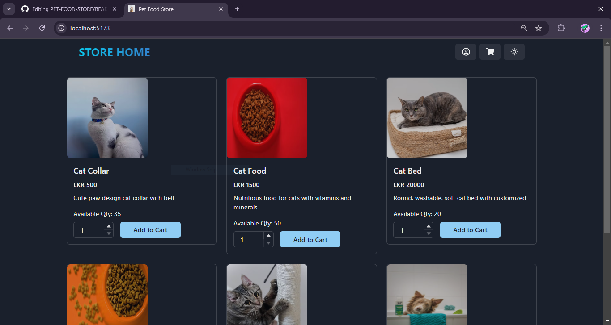
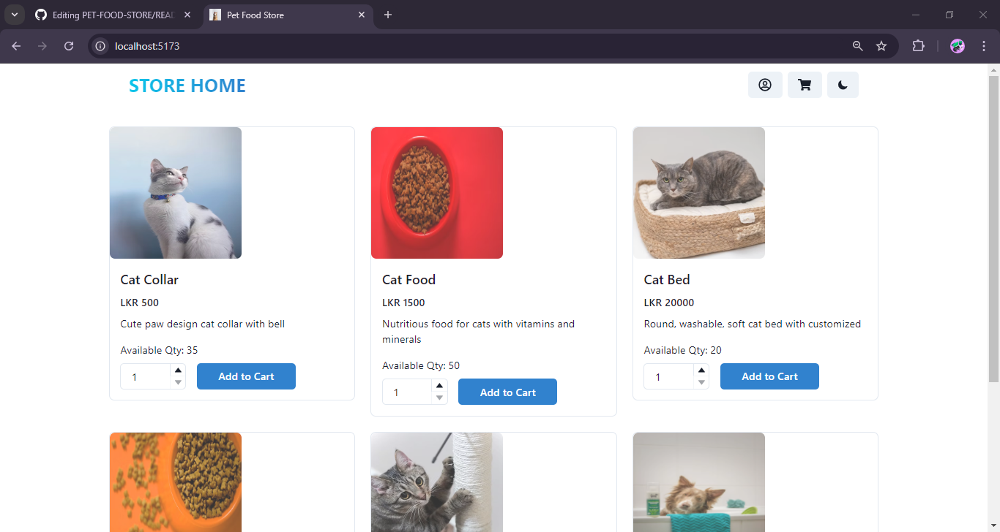
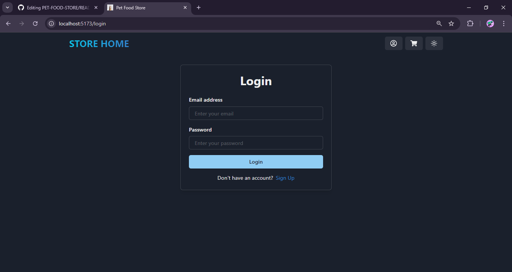
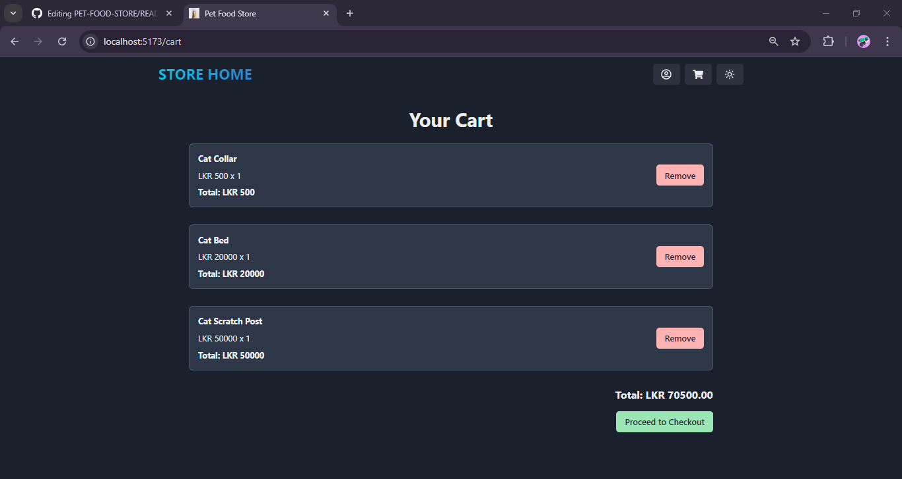

<h1 align="center">Pet Food Store - MERN Stack</h1>

## Overview
- A web application developed with;
  - [Express](https://expressjs.com/) (a back end framework for building RESTful APIs with Node.js) for backend development.
  - [MongoDB](https://www.mongodb.com/) (a document-oriented NoSQL database program) for database management.
  - [React](https://react.dev/) (an open-source frontend library for JavaScript) for frontend development.

- This application provides functionality for;
  - viewing all available products.
  - adding products to a shopping cart.
  - Login and Signup for users.
  - Light and Dark theme toggle.

 

## Tech Stack
[![MongoDB][MongoDB-badge]][MongoDB-url]
[![Express.js][Express-Badge]][Express-url]
[![React][React-badge]][React-url]
[![Node.js][Node-Badge]][Node-url]

## Features

- Home/ Products Page - Dark Theme

  

- Home/ Products Page - Light Theme

  

- Login Page

  

- Cart Page

  

 

## Project Status

- In progress
- Open for collaboration/ feedback

 

## Contact

[![LinkedIn][linkedin-shield]][linkedin-url]

 

<!-- MARKDOWN LINKS & IMAGES -->
[MongoDB-badge]: https://img.shields.io/badge/MONGODB-black?style=for-the-badge&logo=mongodb&logoColor=0FFF50
[MongoDB-url]: https://www.mongodb.com/
[Express-Badge]: https://img.shields.io/badge/Express-black?style=for-the-badge&logo=express&logoColor=white
[Express-url]: https://expressjs.com/
[React-badge]: https://img.shields.io/badge/REACT-black?style=for-the-badge&logo=react&logoColor=0096FF
[React-url]: https://react.dev/
[Node-Badge]: https://img.shields.io/badge/Node-black?style=for-the-badge&logo=Node.js&logoColor=white
[Node-url]: https://nodejs.org/en
[linkedin-shield]: https://img.shields.io/badge/Linkedin-black?style=for-the-badge&logo=linkedin&logoColor=%230277BD
[linkedin-url]: https://linkedin.com/in/danushika-herath

 
